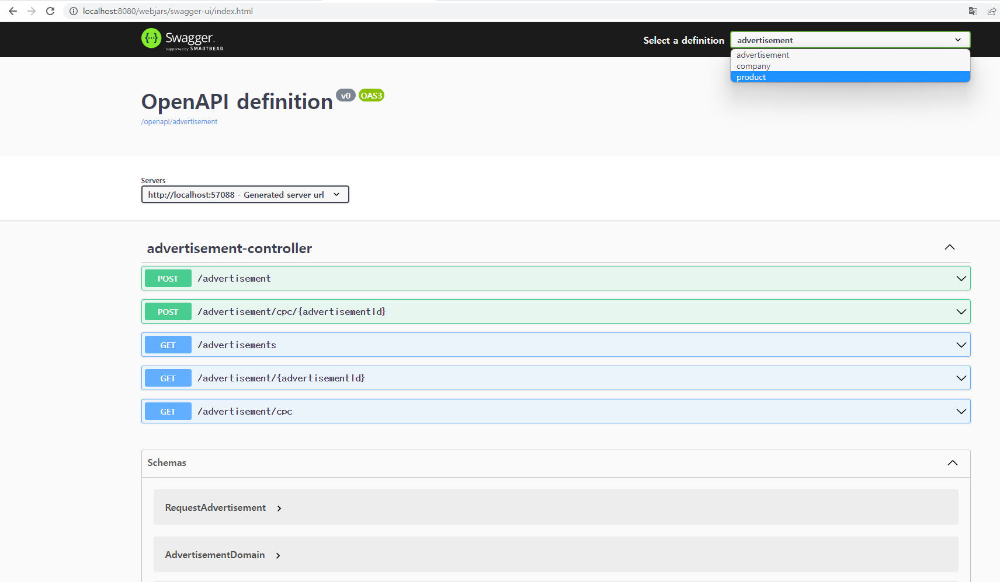

# sellerAd

MSA 적용

MicroService
1. discovery Server
2. Api Gateway
3. 상품 서비스: product
4. 회사/계약 서비스: company/contract
5. 광고 서비스: advertisement
6. 정산 서비스

각 서비스로 요청: http://localhost:8080/{service-name}

사용 기술

Spring Boot, Spring cloud, spring batch, h2(인메모리 DB), Maven, Mybatis, Kafka

API Documentation: http://localhost:8080/swagger-ui.html

1. 상품 등록 -> 회사 등록 -> 등록된 회사 계약 -> 광고입찰
2. 상위 3개 광고 클릭: CPC table에 데이터 저장
3. 매일 새벽 1시 배치 job 실행(정산 서비스), 정산된 데이터 저장 

